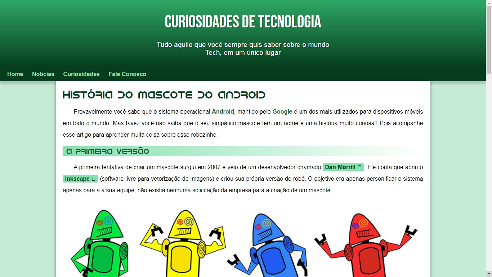

<h3 align="center">
    :heavy_check_mark:Página Modelo do Projeto IDroid
</h3>

## 🔖 Informações
<ul>
    <li>Projeto desenvolvido ao longo do Curso de HTML5 e CSS3 proposto pelo Gustavo Guanabara</li>
    <li>🖱️ <a href="https://marceloisidorio.github.io/IDroid/" target="_blank">Clique aqui</a> para acessar o projeto.</li>
    <li>Confira também o <a href="#">Repositório Oficial</a> do Curso :earth_americas:</li>
</ul>

## 🖼 Screenshot do projeto
</img>
## :rocket:	Tecnologias utilizadas

<a href="https://developer.mozilla.org/pt-BR/docs/Web/HTML" target="_blank">
    
</a>

<a href="https://developer.mozilla.org/pt-BR/docs/Web/CSS" target="_blank">
    
</a>

### :memo: Sobre
- Destaca o cabeçalho com menu e apresentação do artigo
- Efeitos em links e caixas
- Vídeo externo do YouTube
- Contém Aside Inferior com conteúdos periféricos
- Totalmente responsivo
# :hammer_and_wrench: Como rodar localmente

```bash
# Clone o repositório
$ git clone https://github.com/marceloisidorio/IDroid.git

# Acesse a pasta do projeto

# Execute o arquivo "index.html" no navegador de sua preferência
```

## :pushpin: Como contruibuir
- Faça um fork desse repositório.
- Cria uma branch com a sua feature: `git checkout -b minha-feature`
- Faça commit das suas alterações: `git commit -m 'feat: Minha nova feature'`
- Faça push para a sua branch: `git push origin minha-feature`
- Depois que o merge da sua *pull request* for feito, você pode deletar a sua *branch*

## :mortar_board: Autores
<table align="center">
    <tr>
        <td align="center" style="margin: 15px;">
            <a href="https://github.com/marceloisidorio">
                
                <br>
                <sub><b>Marcelo Isidorio</b></sub>
            </a>
        </td>
    </tr>
</table>